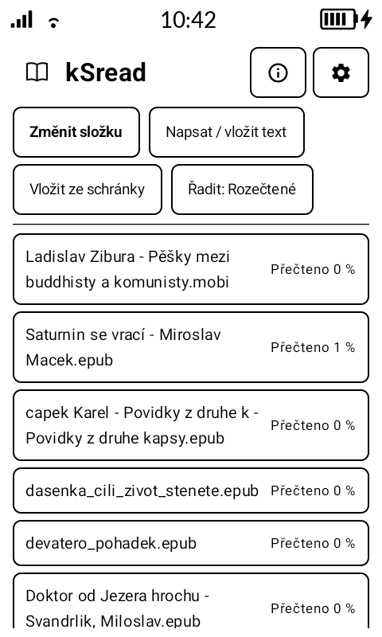
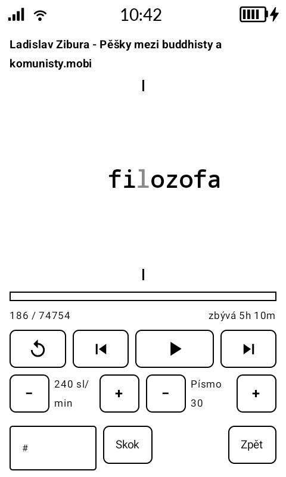

# kSread

A minimal **speed-reading** (RSVP) app for the **Mudita Kompakt** e-ink phone.
Words are flashed one at a time with the focus letter aligned to the eye's
Optimal Recognition Point, so you read without moving your gaze.

## Screenshots

<p>
  
  
</p>

## Features

- **RSVP engine** — adjustable speed (50–1000 WPM) with punctuation-aware
  pauses (longer at sentence ends, commas and long words).
- **ORP display** tuned for e-ink: the word context is pure **black** for
  maximum contrast, the focus letter is a lighter **grey** fixation point.
- **Books from a folder** — pick a folder once (Storage Access Framework, works
  on internal storage or SD card); the app lists every supported book in it.
  Reading position is remembered per book.
- **Formats:** `.txt` (UTF-8 with Windows-1250 fallback), `.epub`, `.mobi`,
  `.mobi.zip`. Also **paste from clipboard** or **type text** directly.
- **E-ink UI** with Mudita Mindful Design: strictly black/white, bordered
  buttons, a determinate (non-animated) progress bar, fits an 800×480 screen.
- Fully **offline** — no network, no accounts, no permissions (SAF grants
  folder access).
- Czech + English (follows the device locale).

## Toolchain

| Component | Version |
|---|---|
| Android Gradle Plugin | 9.4.0 (built-in Kotlin) |
| Gradle | 9.7.1 (wrapper included) |
| Kotlin | 2.4.10 (via `org.jetbrains.kotlin.plugin.compose`) |
| Compose BOM | 2026.08.00 |
| compileSdk / targetSdk | 37 |
| minSdk | 29 (Kompakt is API 31/32) |
| UI | Jetpack Compose + `com.mudita:MMD:1.0.2` (Maven Central) |

Use a JDK 17+ — the Android Studio JBR works:

```bash
export JAVA_HOME=/opt/android-studio/jbr
./gradlew assembleDebug     # dev build -> app/build/outputs/apk/debug/app-debug.apk
./gradlew assembleRelease   # signed build (needs the keystore, see below)
```

`sdk.dir` is written by Android Studio automatically, or set it in
`local.properties` (see `local.properties.example`).

## Signing (generate once, reuse forever)

A different signature makes app updates fail with *"signatures do not match"*,
so generate the keystore **once** and keep it:

```bash
keytool -genkeypair -v \
  -keystore keystore/ksread.jks \
  -alias ksread -keyalg RSA -keysize 2048 -validity 10000
```

Put the `signing.*` values in `local.properties` (gitignored). Back up the
keystore outside this repo. `./scripts/build-release.sh` produces a signed
`ksread-<version>.apk`; pushing a `v*` tag builds it in CI (see
`.github/workflows/release.yml`).

## Install on the Kompakt

Sideload via **Mudita Center**, **WebADB**, or `adb install app-debug.apk`.
No Google Play.

## Using the app

1. **Choose books folder** — point it at wherever your books live (internal
   storage or SD card). The grant is persisted across restarts.
2. Tap a book to open it; reading resumes where you left off.
3. **▶ / ⏸** to play/pause, **◀ / ▶** to step words, **↻** to restart, and the
   **WPM** / **Font** steppers to tune the display. `#` jumps to a word number.
4. Alternatively **Paste from clipboard** or **Type / paste text** to read
   arbitrary text.

## Testing on an emulator

Any Android emulator API ≥ 29. To approximate the Kompakt panel, create an AVD
and set `hw.lcd.width=480`, `hw.lcd.height=800`, `hw.lcd.density=213` in its
`config.ini`.

```bash
export JAVA_HOME=/opt/android-studio/jbr
./gradlew installDebug
adb shell am start -n org.ok1cdj.ksread/.MainActivity
```

## Support

If kSread is useful to you, you can support development:

<a href="https://www.buymeacoffee.com/ok1cdj"></a>

## Architecture

```
parser/  TextDecoder (UTF-8 -> Windows-1250), EpubParser (Zip + XmlPullParser),
         MobiParser (PalmDOC), BookImporter (dispatch by extension)
data/    Library (SAF tree Uri + per-book position, JSON in SharedPreferences),
         ReaderPrefs (wpm / font / uppercase)
ui/      Compose + MMD: MainViewModel (StateFlow + coroutine RSVP loop),
         LibraryScreen (folder + book list), ReaderScreen (ORP display + controls),
         Theme (black/white), Components (AppButton, ProgressBar)
```
